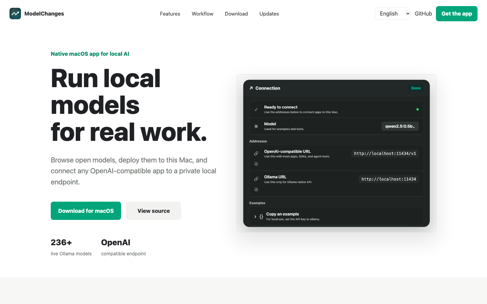
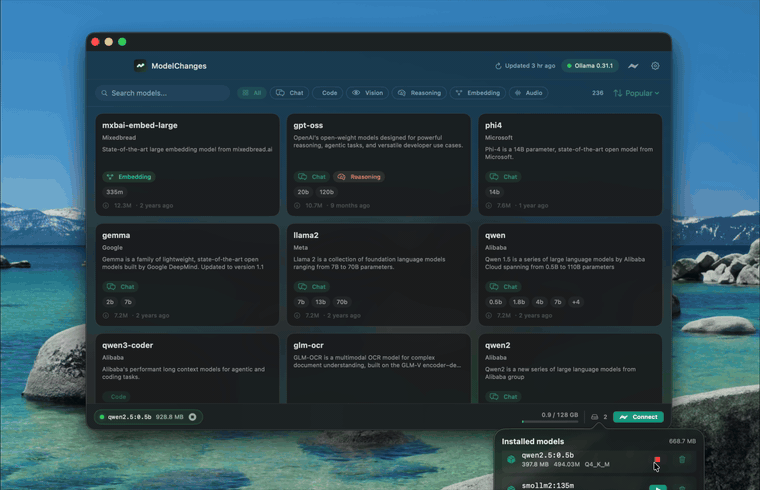

# ModelChanges

**English** · [简体中文](README.zh-CN.md)

[](https://github.com/7757/ModelChanges/releases/latest)
[](https://github.com/7757/ModelChanges/releases)
[](LICENSE)

A native macOS app for browsing, deploying, testing, and connecting local Ollama models.

[Product website](https://7757.github.io/ModelChanges/) · [Latest release](https://github.com/7757/ModelChanges/releases/latest)



## Demo



## Install

```bash
curl -fsSL https://7757.github.io/ModelChanges/install.sh | sh
```

## What It Does

- Browse the live Ollama model catalog from a native macOS app.
- Compare model types, variants, estimated download size, and memory fit.
- Deploy a model with one click, then start, stop, or remove it when needed.
- See loaded models and memory usage from the dock and menu bar.
- Copy OpenAI-compatible endpoint examples for apps, SDKs, and agents.
- Test model capabilities such as text, tool calls, embeddings, and image input when supported by the selected model.

## Local Endpoint

Most OpenAI-compatible tools can point to the local Ollama endpoint:

```bash
export OPENAI_BASE_URL="http://localhost:11434/v1"
export OPENAI_API_KEY="ollama"
export OPENAI_MODEL="qwen2.5:7b"
```

```python
from openai import OpenAI

client = OpenAI(base_url="http://localhost:11434/v1", api_key="ollama")
response = client.chat.completions.create(
    model="qwen2.5:7b",
    messages=[{"role": "user", "content": "Hello!"}],
)
print(response.choices[0].message.content)
```

## Build

Requirements: macOS 14+ and Xcode command-line tools.

```bash
./Scripts/build_app.sh debug run
./Scripts/build_app.sh release
open dist/ModelChanges.app
```

## How It Works

```text
SwiftUI app  ->  Ollama server on localhost:11434  ->  local model
                  /api/tags       list installed models
                  /api/ps         list running models
                  /api/pull       download with streamed progress
                  /api/generate   load and unload with keep_alive
                  /api/delete     remove a model
```

The live model catalog is fetched from `https://ollama.com/library`, cached locally, and refreshed on demand.
