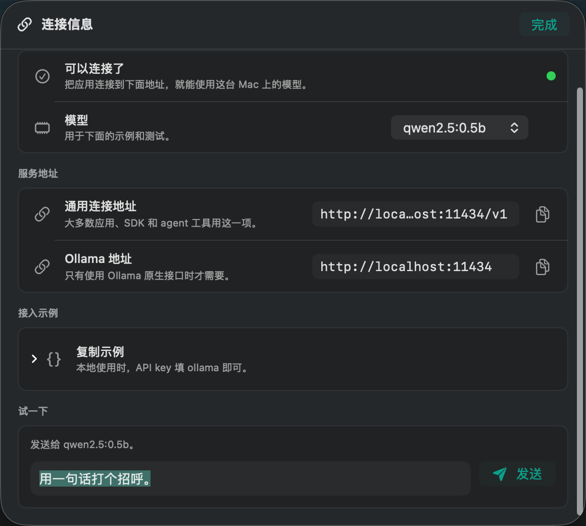

# ModelChanges

[](https://github.com/7757/ModelChanges/releases/latest)
[](https://github.com/7757/ModelChanges/releases)
[](LICENSE)

A native macOS app for **browsing open-source LLMs** and **deploying them locally with one click** — so you can build agents (browser agents, coding agents, RAG apps…) against a free, fast, private local endpoint instead of paying per-token for a remote API during development.

Built with SwiftUI. Uses [Ollama](https://ollama.com) as the local runtime.

[Product website](https://7757.github.io/ModelChanges/) · [Latest release](https://github.com/7757/ModelChanges/releases/latest)



## Install

```bash
curl -fsSL https://7757.github.io/ModelChanges/install.sh | sh
```

## Two core features

### 1. Browse open models (live)
The full **live catalog from ollama.com** (~236 models) — fetched on launch, auto-refreshed every 6 h, and refreshable on demand. The header shows when the list was last synced ("Updated 2m ago").

Each card shows the **key info you need to choose**:

- **Type** — chat / code / vision / reasoning / embedding / audio (derived from live capabilities)
- Parameter sizes / variants, **estimated download size + RAM** (Q4)
- **Pull count** and **when the model was last updated** on ollama.com
- Developer, capabilities (tools, thinking, vision, …)

Search by name/developer, filter by type, sort by Popular / Newest. Click a card for a slide-over inspector with per-variant deploy.

### 2. Deploy · Start · Stop (one click, foolproof, clean)
- **Deploy** — from a model's inspector, one click on a variant downloads it (with live progress) *and* loads it into memory.
- **Fits-your-Mac analysis** — each variant is labelled **Fits / Tight / Too large** based on *this machine's actual RAM* (read at runtime, so it adapts to a 16 GB laptop or a 128 GB Mac). Variants that can't fit are disabled — you can't accidentally deploy something that won't run.
- **Run several at once** — a live **memory meter** in the dock shows `used / total GB`; load as many models concurrently as your headroom allows.
- **Running dock** (bottom bar) — live pills for everything loaded + in-flight downloads, each with one-click **Stop / Cancel**.
- **Installed** popover — Start / Stop / Remove any downloaded model, with disk usage.
- **History** (Settings) — a persistent log of everything you deployed / started / stopped / removed, with timestamps.
- **Clean teardown** — *stop* unloads from memory; *remove* deletes the model from disk; **Remove all models** frees everything; **Reset host** stops + deletes all models, uninstalls Ollama and wipes `~/.ollama`, returning your Mac to exactly how it was before.
- **Connect** button — opens the endpoint panel with the exact local URLs + copy-paste config for your app (see below).

## Point your app at the local model

Ollama exposes an **OpenAI-compatible** endpoint, so most agent SDKs work with a two-line change:

```bash
export OPENAI_BASE_URL="http://localhost:11434/v1"
export OPENAI_API_KEY="ollama"          # any non-empty string works
export OPENAI_MODEL="qwen2.5:7b"        # whatever you deployed
```

```python
from openai import OpenAI
client = OpenAI(base_url="http://localhost:11434/v1", api_key="ollama")
resp = client.chat.completions.create(
    model="qwen2.5:7b",
    messages=[{"role": "user", "content": "Hello!"}],
)
print(resp.choices[0].message.content)
```

The **Endpoint** tab generates these snippets for whichever model you have running, and has a **Quick test** box to confirm the model responds.

## Build & run

Requirements: macOS 14+, Xcode command-line tools (Swift 6). Ollama is installed *for you* from inside the app (or `brew install ollama`).

```bash
# Debug build + launch
./Scripts/build_app.sh debug run

# Optimized build (produces dist/ModelChanges.app)
./Scripts/build_app.sh release

# Then double-click dist/ModelChanges.app, or:
open dist/ModelChanges.app
```

On first launch, if Ollama isn't installed the sidebar shows an **Install Ollama** button (uses Homebrew). Once installed it auto-starts the local server.

## How it works

```
SwiftUI app  ──HTTP──▶  Ollama server (localhost:11434)  ──▶  local model
   │                        /api/tags   list installed
   │                        /api/ps     list running
   │                        /api/pull   download (streamed progress)
   │                        /api/generate (keep_alive) load / unload
   │                        /api/delete remove
   └── your agent ─────────▶ /v1/chat/completions  (OpenAI-compatible)
```

- `Sources/ModelChanges/` — Swift sources
  - `App.swift` — app entry, compact header, filters, brand/status/search
  - `Cards.swift` — Feature 1 (live model card grid)
  - `Inspector.swift` — slide-over detail + one-click per-variant deploy
  - `Dock.swift` — Feature 2 (running dock, installed popover)
  - `Panels.swift` — endpoint + test chat + settings sheets
  - `Library.swift` — live fetch/parse of ollama.com + disk cache + offline seed
  - `OllamaService.swift` — app state, Ollama HTTP + local process control
  - `Models.swift`, `Components.swift`
- `Scripts/make_icon.swift` — renders the app icon (`Resources/AppIcon.icns`)
- `Scripts/build_app.sh` — compiles and wraps into a `.app` bundle

## Recommended models for agent development (on Apple Silicon)

| Use case | Model | Why |
|---|---|---|
| Fast general agent | `qwen2.5:7b` / `llama3.1:8b` | Strong tool-calling, fits 16 GB |
| Best small coder | `qwen2.5-coder:7b` | Excellent code + fill-in-the-middle |
| Reasoning | `deepseek-r1:14b` / `qwen3:14b` | Explicit chain-of-thought |
| Vision | `llama3.2-vision:11b` / `gemma3:12b` | Image understanding |
| Big brain (128 GB) | `llama3.3:70b` / `qwen3:32b` | Near-frontier quality, fully local |

## Where the model list comes from

The catalog is **not hardcoded** — it's scraped live from `https://ollama.com/library` (the `x-test-*` attributes on each card) by `Library.swift`, cached to `~/Library/Application Support/ModelChanges/library.json`, and re-synced every 6 hours or on demand. A small offline seed (`LibrarySeed`) covers a fresh first launch with no network.
