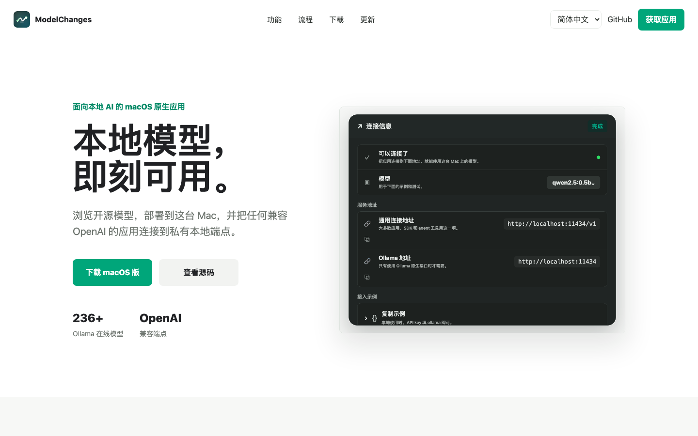

# ModelChanges

[English](README.md) · **简体中文**

[](https://github.com/7757/ModelChanges/releases/latest)
[](https://github.com/7757/ModelChanges/releases)
[](LICENSE)

一个 macOS 原生应用，用来浏览、部署、测试并连接本地 Ollama 模型。

[产品官网](https://7757.github.io/ModelChanges/) · [最新版本](https://github.com/7757/ModelChanges/releases/latest)



## 演示


## 安装

```bash
curl -fsSL https://7757.github.io/ModelChanges/install.sh | sh
```

## 它能做什么

- 在 macOS 原生应用里浏览 Ollama 在线模型目录。
- 查看模型类型、规格、预计下载大小和内存适配情况。
- 一键部署模型，并按需启动、停止或移除。
- 从底部栏和菜单栏查看已加载模型与内存占用。
- 复制 OpenAI 兼容的本地端点示例，用于应用、SDK 和 agent 工具。
- 按当前模型能力测试文本、工具调用、嵌入向量和图片输入。

## 本地端点

大多数兼容 OpenAI 的工具都可以连接到本地 Ollama 端点：

```bash
export OPENAI_BASE_URL="http://localhost:11434/v1"
export OPENAI_API_KEY="ollama"
export OPENAI_MODEL="qwen2.5:7b"
```

```python
from openai import OpenAI

client = OpenAI(base_url="http://localhost:11434/v1", api_key="ollama")
response = client.chat.completions.create(
    model="qwen2.5:7b",
    messages=[{"role": "user", "content": "Hello!"}],
)
print(response.choices[0].message.content)
```

## 构建

要求：macOS 14+ 和 Xcode Command Line Tools。

```bash
./Scripts/build_app.sh debug run
./Scripts/build_app.sh release
open dist/ModelChanges.app
```

## 实现原理

```text
SwiftUI 应用  ->  localhost:11434 上的 Ollama 服务  ->  本地模型
                  /api/tags       列出已安装模型
                  /api/ps         列出运行中模型
                  /api/pull       下载并返回进度
                  /api/generate   通过 keep_alive 加载或卸载
                  /api/delete     删除模型
```

模型目录来自 `https://ollama.com/library`，会缓存在本地，并可按需刷新。

## 下一步待办

按优先级大致排序，持续推进：

- **签名与公证** —— 用 Developer ID 签名+公证，首次打开不再有 Gatekeeper 提示。
- **应用内自动更新** —— 检查 GitHub Releases 并原地更新。
- **Agent 预设** —— 把 base URL + 模型存成命名配置，一键复制到常见框架。
- **实时吞吐** —— 每个运行中的模型显示 tokens/秒、首字延迟。
- **量化选择** —— 每个模型可选具体 tag/量化，而非只用默认。
- **多轮对话调试台** —— 一个小聊天窗口做手动测试，不只是单条 prompt。
- **更瘦的运行时** —— 进一步裁剪内置引擎，并支持首次运行时按需下载。
- **Hugging Face GGUF 搜索** —— 直接拉社区 GGUF 模型，不限于 Ollama 库。
